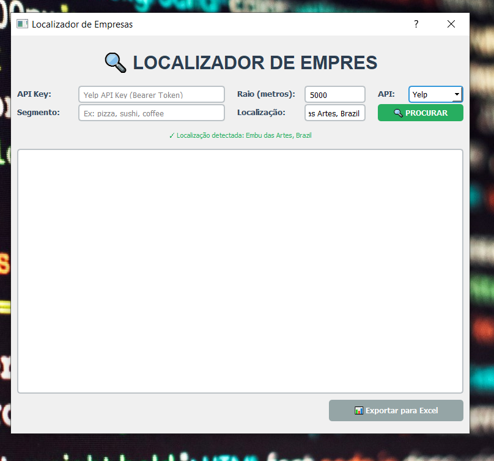

# 🔍 Localizador de Empresas

Sistema desktop para localizar empresas próximas usando múltiplas APIs de geolocalização.



## 📋 Funcionalidades

- ✅ Busca empresas por proximidade (raio configurável)
- ✅ Suporte a **4 APIs diferentes**: Google Places, Yelp, Foursquare e OpenStreetMap
- ✅ Detecção automática de localização via IP
- ✅ Interface gráfica intuitiva com PyQt5
- ✅ Exportação dos resultados para Excel
- ✅ Busca em background (não trava a interface)
- ✅ Validação completa de entradas
- ✅ Tratamento robusto de erros

## 🚀 Instalação

### Pré-requisitos

- Python 3.7 ou superior
- pip (gerenciador de pacotes do Python)

### Passo a Passo

1. **Clone ou baixe o projeto**

2. **Instale as dependências**
```bash
pip install -r requirements.txt
```

3. **Execute o programa**
```bash
python localizador_empresas.py
```

## 🔑 Configuração de APIs

O programa suporta 4 APIs. Você precisará de chaves (API Keys) para usar a maioria delas:

### 1. Google Places API
- **Precisa de API Key**: ✅ Sim
- **Como obter**: https://developers.google.com/maps/documentation/places/web-service/get-api-key
- **Custo**: Tem plano gratuito com limite de requisições
- **Melhor para**: Dados completos e precisos, com avaliações

### 2. Yelp API
- **Precisa de API Key**: ✅ Sim
- **Como obter**: https://www.yelp.com/developers/v3/manage_app
- **Custo**: Gratuito (com limites)
- **Melhor para**: Restaurantes, bares, serviços locais

### 3. Foursquare API
- **Precisa de API Key**: ✅ Sim
- **Como obter**: https://foursquare.com/developers/apps
- **Custo**: Tem plano gratuito
- **Melhor para**: Locais turísticos, pontos de interesse

### 4. OpenStreetMap (OSM)
- **Precisa de API Key**: ❌ Não (totalmente gratuito!)
- **Limitação**: Menos dados detalhados
- **Melhor para**: Teste rápido sem precisar de API Key

## 📖 Como Usar

1. **Escolha a API** no menu dropdown (Google, Yelp, Foursquare ou OSM)

2. **Insira a API Key** (exceto para OSM)

3. **Defina o segmento** que deseja buscar:
   - Google: `restaurant`, `cafe`, `gym`, `hotel`, `bank`
   - Yelp: `pizza`, `sushi`, `coffee`, `bar`
   - Foursquare: `restaurant`, `bar`, `hotel`, `museum`
   - OSM: `restaurant`, `cafe`, `hospital`, `school`

4. **Defina o raio** em metros (padrão: 5000 = 5km, máximo: 50km)

5. **Clique em PROCURAR** e aguarde os resultados

6. **Exporte para Excel** se desejar salvar os dados

## 📊 Colunas Exportadas

- **Nome**: Nome da empresa
- **Endereço**: Endereço completo ou aproximado
- **Avaliação**: Nota/rating (quando disponível)
- **Reviews**: Número de avaliações
- **Latitude**: Coordenada geográfica
- **Longitude**: Coordenada geográfica

## 🎨 Interface

A interface possui:
- Design moderno com cores suaves
- Feedback visual de todas as operações
- Contador de resultados encontrados
- Indicador de carregamento durante buscas
- Mensagens de erro claras e descritivas

## ⚠️ Problemas Comuns

### "API Key inválida"
- Verifique se copiou a chave completa
- Confirme que a API está ativada no console do provedor
- Aguarde alguns minutos após criar a chave

### "Nenhuma empresa encontrada"
- Tente aumentar o raio de busca
- Verifique se o segmento está correto
- Use termos em inglês para melhores resultados

### "Erro de conexão"
- Verifique sua conexão com a internet
- Alguns firewalls podem bloquear as requisições
- Tente usar o OSM (não precisa de API Key)

## 🛠️ Tecnologias Utilizadas

- **Python 3.x**
- **PyQt5**: Interface gráfica
- **Pandas**: Manipulação e exportação de dados
- **Requests**: Requisições HTTP para APIs
- **OpenPyXL**: Geração de arquivos Excel

## 📝 Licença

Este projeto é de uso livre para fins educacionais e comerciais.

## 👨‍💻 Contribuições

Sugestões e melhorias são bem-vindas!

## 📞 Suporte

Se encontrar problemas:
1. Verifique se instalou todas as dependências
2. Confirme que suas API Keys estão corretas
3. Teste primeiro com OSM (não precisa de chave)
4. Leia as mensagens de erro com atenção

---

**Desenvolvido com ❤️ usando Python e PyQt5**
